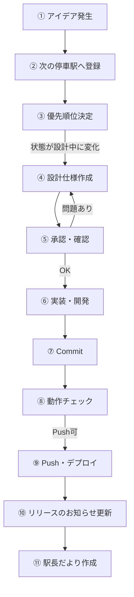

![[開発フロー全体マップ.png]]

## アイデア・要望発生時のフロー

| No | 工程 | 内容 |
|---|---|---|
| 1 | アイデア・要望発生 | 思いつきや利用者の声（VOC）、気づきなどから改善案・機能案を収集する。 |
| 2 | 次の停車駅へ登録 | 「次の停車駅（プロダクトバックログ）」へ登録し、背景や目的を整理する。 |
| 3 | 優先順位決定 | 次の停車駅で優先順位・状態を管理する。 |
| ▶ | フラグ | 状態を**「設計中」**へ変更した案件は④へ進む。 |
| 4 | 設計仕様作成 | ChatGPTへ相談しながら要件整理・画面設計・データ構成などの設計仕様を作成する。[[開発フロー#設計仕様テンプレート|→ 詳細]] |
| 5 | 承認・確認（自分レビュー） | 設計内容・優先順位・実装方針を確認し、実装可否を判断する。問題があれば④へ戻って設計を見直す。 |
| 6 | 実装・開発 | Codexでコード生成・修正・反映を行い、ローカル環境で動作確認する。 |
| 7 | Commit | GitHubへCommitする。Summary・Descriptionは必要に応じてChatGPTへ相談する。Commit後は[[開発ログ]]へ記録する。 |
| 8 | 動作チェック | 公開予定サイトで最終動作確認を行う。問題がなければPush・デプロイへ進む。 |
| ▶ | フラグ | Netlifyクレジットを消費してもよい場合のみ⑨へ進む。 |
| 9 | Push・Netlifyデプロイ | GitHubへPushし、Netlifyでサイトを公開する。 |
| 10 | リリースのお知らせ更新 | [[リリース履歴]]に公開バージョンと更新内容を記録する。 |
| 11 | 駅長だより作成（月1回） | 発行時期に合わせて更新内容や活動報告をまとめ、月1回A4で印刷してリワーク赤坂へ配布する。 |

## 発生ベース（並行作業）

| 工程        | 内容                                 |
| --------- | ---------------------------------- |
| フィードバック収集 | VOCへ記録し、必要に応じて[[次の停車駅]]Excelへ登録する。 |
| ドキュメント更新  | 設計・ルール・マニュアルなどを必要に応じて更新する。         |
| 動作確認      | 公開Webサイトで必要に応じて動作確認を行う。            |